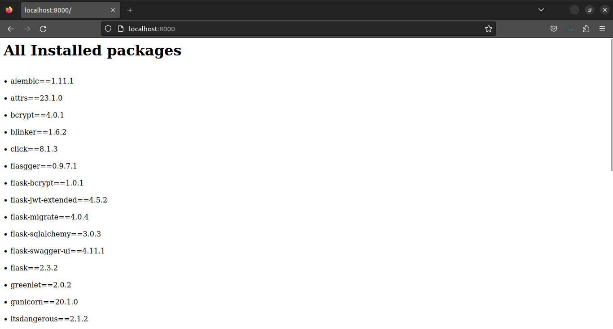
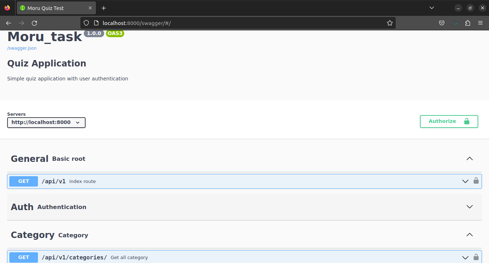

# Flask Quiz App Documentation

## Installation

1. Clone the repository: `git clone https://github.com/HeartBlack/moru-task.git`
2. Create a virtual environment: `pip install virtualenv`
3. Set up the virtual environment: `virtualenv env`
4. Activate the virtual environment: `source env/bin/activate`
5. Install dependencies: `pip install -r requirements.txt`
6. Run the application: `gunicorn --bind 0.0.0.0:8000 --reload wsgi:app`

### Docker Installation

1. Run Docker: `docker-compose up --build`

If you have successfully installed the application, you will see a preview of the running application. To preview it, visit [http://localhost:8000/](http://localhost:8000/).



For the Swagger UI, visit [http://localhost:8000/swagger/](http://localhost:8000/swagger/).



---
###### **Note: If you facing some issues with swagger you can try with postman
---
### Using Postman documentation:
In the source Folder, there is a postman.json file you can import into your postman.

### Creating A Super User:
To create a superuser, you can do it using either of the following methods:

- From the endpoint:
  - In `/api/v1/register/`, provide `user_type` as `admin` in the JSON file.

- From the Docker web CLI:
  1. First, check if your web container is running by typing:
     ```
     docker ps
     ```

     You should see an output similar to this:

     ```
     CONTAINER ID   IMAGE          COMMAND                  CREATED       STATUS          PORTS                                       NAMES
     696b37577261   morutask-web   "/usr/src/app/entryp…"   2 hours ago   Up 52 minutes   0.0.0.0:8000->8000/tcp, :::8000->8000/tcp   morutask-web-1
     ffed62bef5b8   postgres:13    "docker-entrypoint.s…"   2 hours ago   Up 52 minutes   5432/tcp
     ```

  2. Execute the following command:
     ```
     docker exec -it [Container_id] bash
     ```
     Replace `[Container_id]` with the actual container ID (e.g., `696b37577261`).

  3. Execute the following command:
     ```
     python manage.py createsuperuser
     ```

## Endpoints in this app:

| Endpoint Name         | Methods | Endpoint                   | Usecase                    | Access  |
|-----------------------|---------|----------------------------|----------------------------|---------|
| create_answer         | POST    | /api/v1/answers/           | Create an answer           | Admin   |
| create_category       | POST    | /api/v1/categories/        | Create a category          | Admin   |
| create_question       | POST    | /api/v1/questions/         | Create a question          | Admin   |
| create_quiz           | POST    | /api/v1/quizs/             | Create a quiz              | Admin   |
| create_user_response  | POST    | /api/v1/user-response/     | Submit user response       | Guest   |
| delete_answers        | DELETE  | /api/v1/answers/<id>/      | Delete an answer           | Admin   |
| delete_category       | DELETE  | /api/v1/categories/<id>/   | Delete a category          | Admin   |
| delete_questions      | DELETE  | /api/v1/questions/<id>/    | Delete a question          | Admin   |
| get_answers           | GET     | /api/v1/answers/           | Get all answers            | User and Admin   |
| get_categories        | GET     | /api/v1/categories/        | Get all categories         | Admin   |
| get_questions         | GET     | /api/v1/questions/         | Get all questions          | Guest   |
| get_quiz              | GET     | /api/v1/quizs/             | Get all quizzes            | Guest   |
| get_summary           | GET     | /api/v1/user-score-summery/| Get user score summary     | Guest   |
| get_user_response     | GET     | /api/v1/user-response/     | View user quiz responses   | Guest   |
| index                 | GET     | /api/v1/                   | Main page of the app       | All   |
| login_user            | POST    | /api/v1/login/             | User login                 | All   |
| register_user         | POST    | /api/v1/register/          | User registration          | All   |
| update_answer         | PUT     | /api/v1/answers/<id>/      | Update an answer           | Admin   |
| update_category       | PUT     | /api/v1/categories/<id>/   | Update a category          | Admin   |
| update_question       | PUT     | /api/v1/questions/<id>/    | Update a question          | Admin   |
| test_page             | GET     | /                          | Testing page of the app    | All   |

---

Thank you for choosing our Flask Quiz App! If you encounter any issues or have any questions, please don't hesitate to reach out to our support team. Enjoy your quiz experience!
